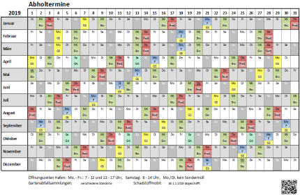

# abfall

Converts the ICS download of garbage collection dates into a single A4-sized Excel file for printing.
Useful in some parts of Germany.

The ICS download is available from [https://*YOURCITY*.mein-abfallkalender.de/](https://YOURCITY.mein-abfallkalender.de/),
where *YOURCITY* must be replaced with, you guessed it, your city. Not all communities in Germany are listed, but
if yours is missing, you can register for a notification as soon as it gets added.

The result of the conversion looks something like this:

The file should be printed on one page, so select "Fit sheet on one page" when printing from Excel. Also, choosing
narrow margins is a good idea.

## Download

https://github.com/tsjensen/abfall/releases

## Running it

In order to run the program, you need:
 
- Java 8 or newer ([download](https://adoptium.net/temurin/releases/?version=8)) - A JRE is sufficient, unless
  you want to develop it (see below).
- The `JAVA_HOME` environment variable points to your Java. This normally means it is set to a value similar to
  `C:\PROGRA~1\Java\jdk8u202-b08` (on Windows).
- The downloaded program unzipped to a directory somewhere.

Change into the directory where you unpacked the program, then:

    bin\abfall -y 2023 my-downloaded.ics

and it will generate the `.xlsx` file.

Additional options are:

| Option                 | Description                                                                  |
|:-----------------------|:-----------------------------------------------------------------------------|
| `-h`,`--help`          | Print usage information                                                      |
| `-l`,`--locale <code>` | Locale for printing date information (not a real translation; default: `de`) |
| `-o`,`--output <xls>`  | Name of the Excel file to create (output file)                               |
| `-y`,`--year <year>`   | *(required)* The four-digit year for which the summary is being created      |

The `--locale` option will only affect the month and weekday names, it is not a full translation.

### Holidays

When a garbage collection date falls onto a public holiday, the weekday name will appear underlined. This is to
signify that it is unlikely that they will be able to actually come on that day.

Holidays are configured in a
[property file](https://github.com/tsjensen/abfall/blob/2023.1/src/main/resources/com/thomasjensen/abfall/feiertage.properties).
They are specific to a particular year, so they may not fit. I will update to the current year when I use the program
for myself.

## Development

Same prereqs as for running it, but make sure you have a JDK, plus [Git](https://git-scm.com/downloads).

    git clone https://github.com/tsjensen/abfall.git
    cd abfall
    .\gradlew build

The unpacked distribution will be created in *build/distributions/unpacked*.

## Status

The program is complete and ready to use.
 
But: It makes a lot of assumptions about its input, and is only used once per year by myself anyway,
so your mileage may vary. Do let me know about any quirks, though.

## License

The program is free software under the terms of the
[GNU General Public License, version 3](LICENSE.md).
